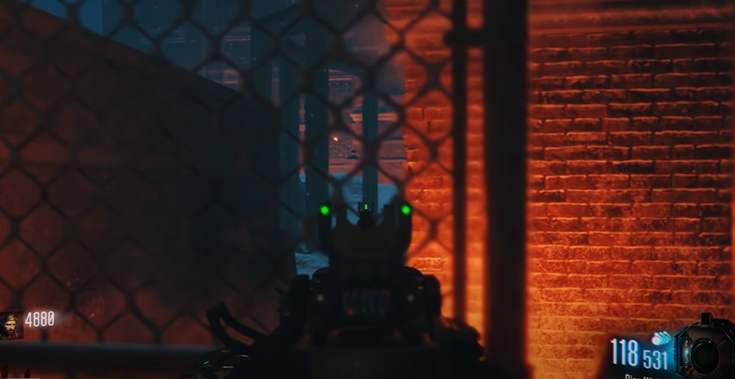
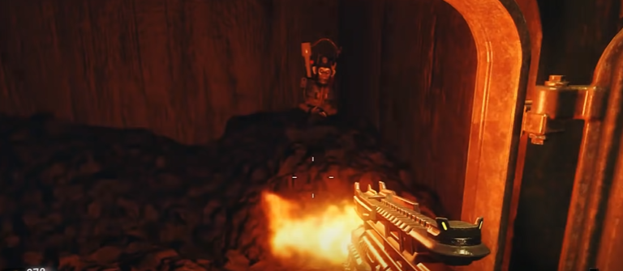
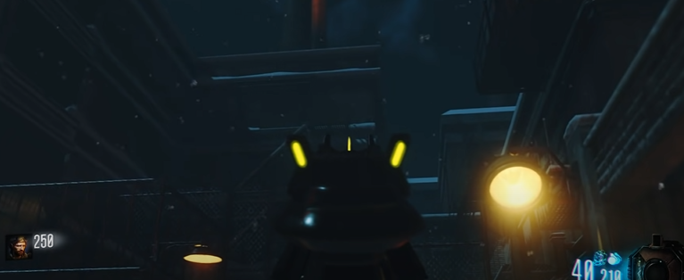
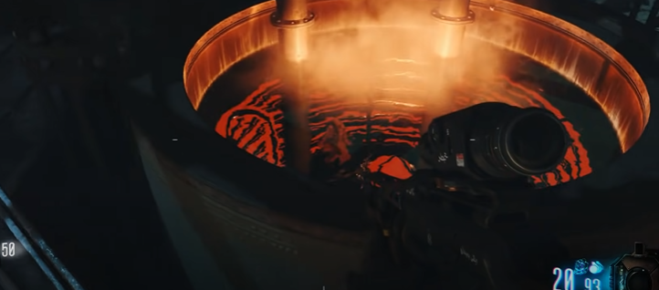
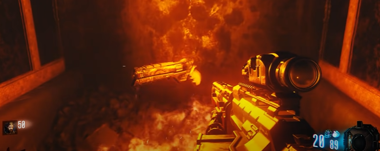

# The Giant Main Quest Guide

## Steps

### Step 1:
Shoot a panel outside the map behind this fence with a pack-a-punched gun:\
\

### Step 2:
Shoot the three items with a pack-a-punched gun.

#### Item locations:
In the furnace by teleporter A.\
\
\
On the catwalk next to teleporter B.\
\
\
In the vat by teleporter C.\

### Step 3:
Pick up the Annihilator:\
\

### Step 4:
gg time for shadows
